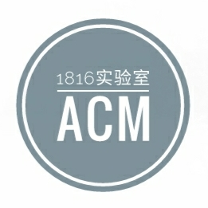
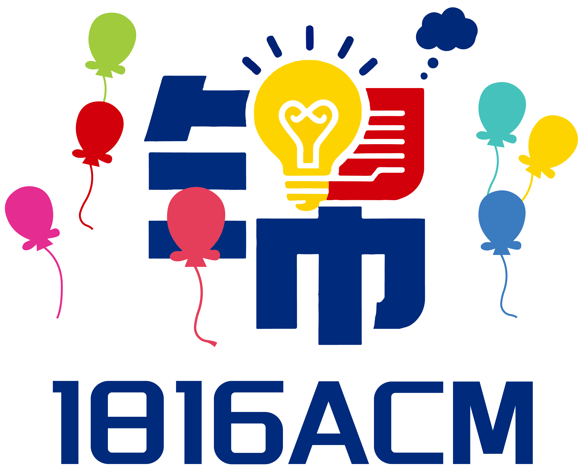
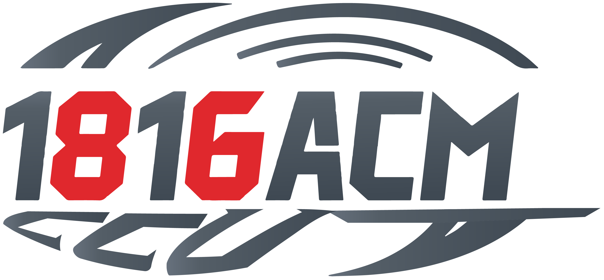

# 1816

1816实验室是博主在本科阶段所加入的重要公益性算法竞赛集训队，使博主能在二本拥有与985同台竞技的机会。博主对1816感激不尽。

??? note "1816实验室简介"
    以下内容为博主为1816OJ编写的简介，执笔于2025.7：

    

        <figure>
            
            <figcaption>1816 logo</figcaption>
        </figure>
        <figure>
            
            <figcaption>2025纪念 logo</figcaption>
        </figure>
        <figure>
            
            <figcaption>2025卫衣 logo</figcaption>
        </figure>
    

    锦•1816ACM-ICPC实验室(下简称1816实验室)成立于2013年，原隶属于长春工业大学(CCUT)新闻与传播学院(原信息传播工程学院)计算机基础教学中心，2025年随计算机基础教学中心并入计算机科学与工程学院。实验室吸引了来自全校各学院的高水平OI选手及高度热爱算法竞赛与计算机科学的人组成了一支有历史、有信念、有传承的高水平公益集训队，代表了CCUT算法竞赛事业的最高水平。

    实验室历经十余年的发展，指导百余名学生积极投身于国际大学生程序设计竞赛(ICPC)、中国大学生程序设计竞赛(CCPC)、中国高校计算机大赛-团体程序设计天梯赛(CCCC-GPLT)、工业与信息化部蓝桥杯全国软件和信息技术专业人才大赛、工业与信息化部睿抗机器人开发者大赛(RaiCom,原RobCom世界机器人开发者大赛)等国内外知名的算法竞赛，并屡获殊荣，获十余项国际级奖项，数十项国家级奖项、百余项省级奖项。

    实验室拥有数十次承办比赛的经验，包括但不限于省内邀请赛、校赛、院赛、假期训练赛等。1816 Online Judge是实验室的重要训练资源，历经十余年的更新迭代，目前已迭代到第5代，由常态化OJ与现场赛OJ两部分组成。本站作为常态化OJ，致力于存档实验室承办比赛题目，为选手们提供比赛补题与历史真题训练的作用。

    实验室毕业生发展优异：考研率高达60%，且75%考入985、211等重点高校；超60%学生入职华为、小米、百度、腾讯、美团、字节跳动、快手等国内外知名IT企业或国家级事业单位。

    站在新时代，1816实验室将率先迎接新挑战，始终为建设成为国内一流、国际知名的特色品牌竞赛集训队而不懈努力奋斗！

1816实验室代号「River」，象征着集训队、岁月、时光、人生都是一条河流；薪火相传，川流不息，涌流不止；你我相遇，皆为人生中的过客，人永远不可能两次踏入相同的河流；**此情可待成追忆，只是当时已惘然**。1816也有一本著名的电子藏书——《If Life is A River》。

博主非常怀念在1816的时光，也同样反映了博主关于人性的矛盾：服役时没有感受到分量与珍贵，也未加珍惜；退役后，失去了才懂得珍惜。这也是博主人性的弱点，终成一生的遗憾。

## 1816对博主的意义
博主感谢1816，培养了博主以下能力：

- 深入计算机科学探索的毅力
- 持续专注的学习能力
- 计算思维，基础码力
- 信息检索能力
- 为他人着想的能力。特别是在1816遇到了首个让博主投入情感如此之深的队友/朋友(队长陈柯嵩[^1])

但也存在部分遗憾，博主的以下能力仍需继续培养：

- 算法思维
- 待人接物、品德素养、言行举止、察言观色、人情世故
- 生活自理能力
- 与他人沟通的能力
- **持续性**的默默无私奉献能力
- 靠谱能力，常规任务处理能力，默默执行任务能力
- 科研能力
- 情绪控制能力
- 志同道合、并肩作战、团队协作的能力
- 个人素质(守口如瓶的能力，懂得分寸的能力)

## 1816对博主的要求
博主在退役时，1816给博主提出了6点要求：

- 禁止随时使用IM(Instant Messaging，即时通讯)工具，禁止发布不合适内容，禁止做即时性、脉冲性的汇报，要主动沉淀，做阶段性汇报
- 码力和思维不能断！
- 锻炼，跑步，减肥
- 持续性的英语训练
- 持续专注于一个方向
- 守口如瓶，三思后行，把握分寸

男人需要锻炼的5点：

- 练气场与胆识
- 练扛事与担当
- 练脸皮与争取
- 练拒绝与守口
- 练胸怀与识人

[^1]: 陈柯嵩绝对是对博主非常重要的人，本博客专门有一篇文章，详细记录博主与陈柯嵩的时光。陈柯嵩是博主首个交心、投入情感如此之大、如此热爱的朋友，是博主心目中「永远的队长」。但由于博主自身的缺陷，目前还得不到陈柯嵩的认可，这也是博主永远的遗憾。在陈柯嵩华丽转身的谢幕中，英文队名为「Like River」。